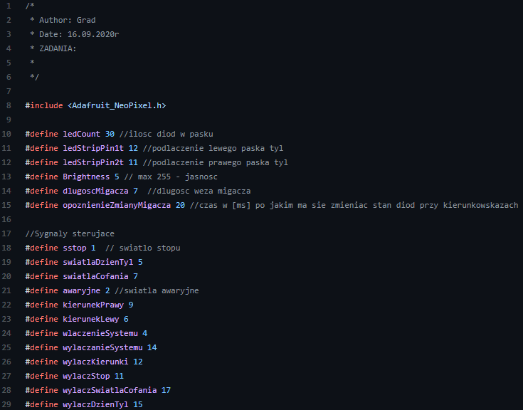

# Electric Car Lamps
>The aim of this project was to create controller to change front and rear lights in an electric car.

## Table of contents
* [General info](#general-info)
* [Screenshots](#screenshots)
* [Technologies](#technologies)
* [Features](#features)
* [Status](#status)
* [Contact](#contact)

## General info
The Company which is making the prototype of the electric car wanted to implement lights using lighting effects on LEDs WS2812B.

## Screenshots
Will be added.

## Technologies
C,
Arduino IDE,
WS2812B

## Code Examples

Functions to controlling the lights:

## Features
- Power ON and OFF effects,
- Emergency lights,
- Dynamic floating led turn signals,

## To-do list
In the next version of prototype I`ll transfer the design to STM.

## Status
The aim of this project to this version of protoype car was reached.

## Contact
Created by https://www.linkedin.com/in/kamil-gradowski-8706991aa - feel free to contact me!
grados73
